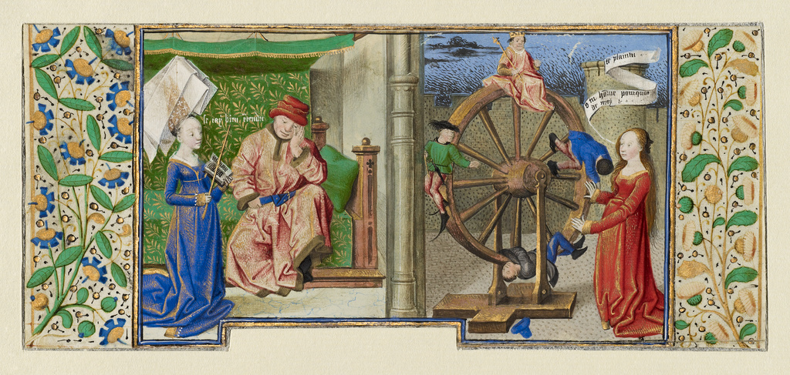

---
widget: blank
headless: true

# ... Put Your Section Options Here (title etc.) ...
# title: Teaching
# subtitle:
weight: 40  # section position on page
design:
  # Choose how many columns the section has. Valid values: 1 or 2.
  columns: '2'
  spacing:
    padding: ["20px", "0", "20px", "0"]
---

*Philosophy Consoling Boethius and Fortune Turning the Wheel* [(Getty Museum)](http://www.getty.edu/art/collection/objects/127275/coetivy-master-henri-de-vulcop-philosophy-consoling-boethius-and-fortune-turning-the-wheel-french-about-1460-1470/).
